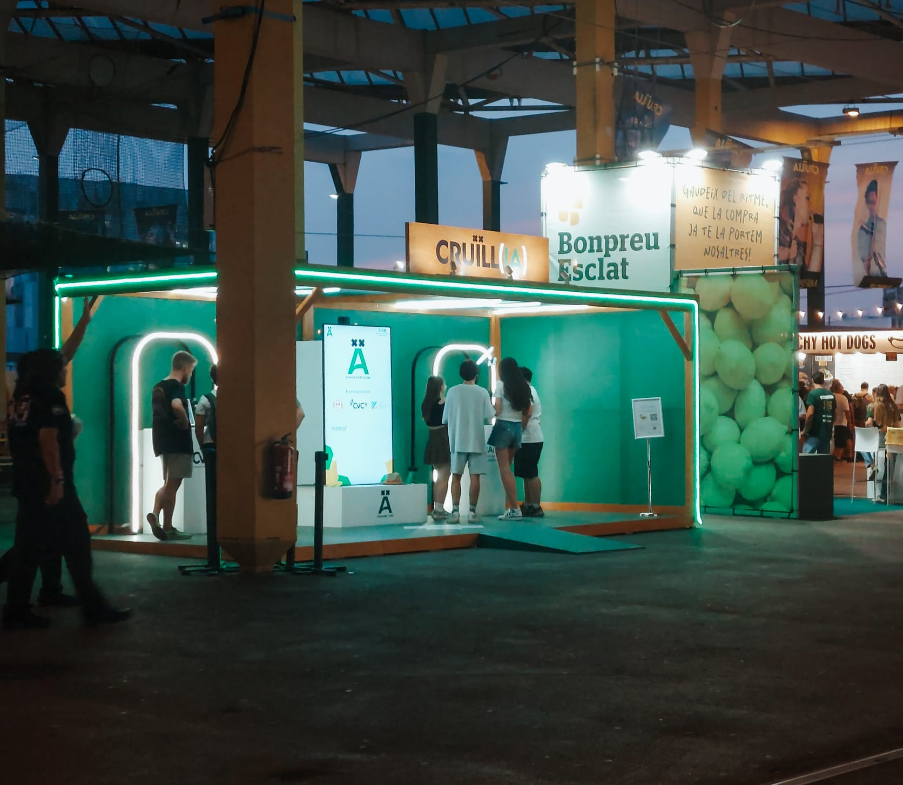
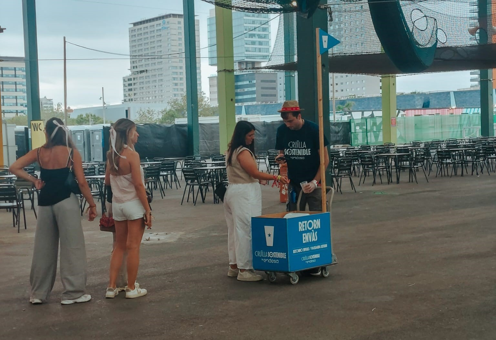

# Documentación gráfica del Festival Cruïlla

Esta carpeta contiene fotografías del trabajo de campo realizado durante el Festival Cruïlla 2025, tanto del propio festival como de los resultados de cada prototipo.

#Festival Cruïlla
<figure align="center">
  
  <figcaption><em>Buzz de la Cátedra UAB-Cruïlla durante el día.</em></figcaption>
</figure>

<figure align="center">
  
  <figcaption><em>Buzz de la Cátedra UAB-Cruïlla durante la noche.</em></figcaption>
</figure>

<figure align="center">
  
  <figcaption><em>Ejemplo de escenario del festival.</em></figcaption>
</figure>

<figure align="center">
  
  <figcaption><em>Estética de grafitis observada en el Festival Cruïlla.</em></figcaption>
</figure>

<figure align="center">
  
  <figcaption><em>Muro de grafitis en el recinto del festival.</em></figcaption>
</figure>

<figure align="center">
  
  <figcaption><em>Ejemplo de comercio de proximidad que apolla el festival.</em></figcaption>
</figure>

<figure align="center">
  
  <figcaption><em>Elementos vinculados a la sostenibilidad que apolla el festival.</em></figcaption>
</figure>
