# Documentación gráfica del Festival Cruïlla

Esta carpeta contiene fotografías del trabajo de campo realizado durante el Festival Cruïlla 2025, tanto del propio festival como de los resultados de cada prototipo.

# Festival Cruïlla

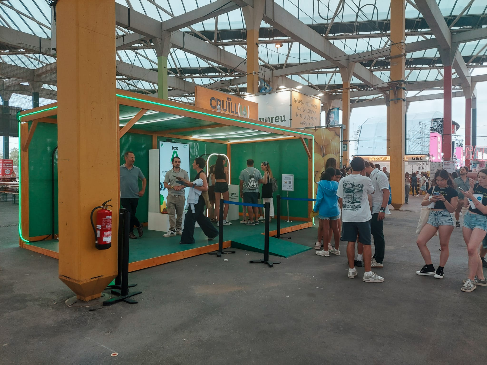
 
<em>Buzz de la Cátedra UAB-Cruïlla durante el día.</em>
   

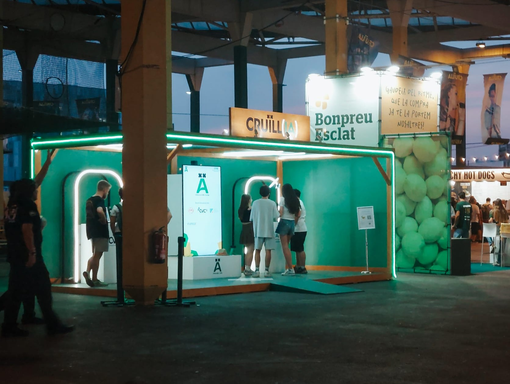
 
<em>Buzz de la Cátedra UAB-Cruïlla durante la noche.</em>
   

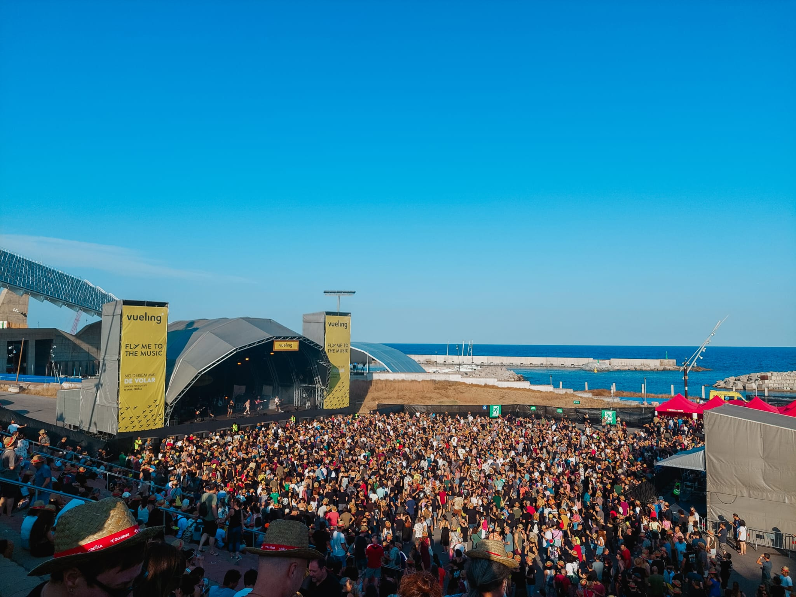
 
<em>Ejemplo de escenario del festival.</em>
   

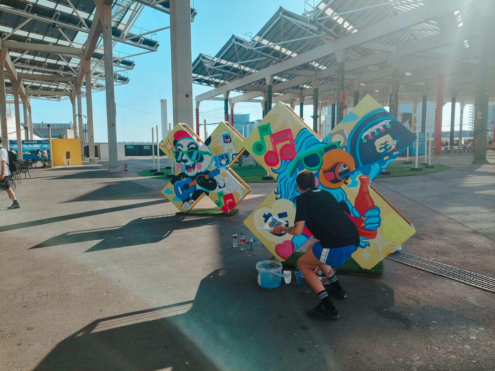
 
<em>Ejemplo de la estética de grafiti del festival.</em>
   

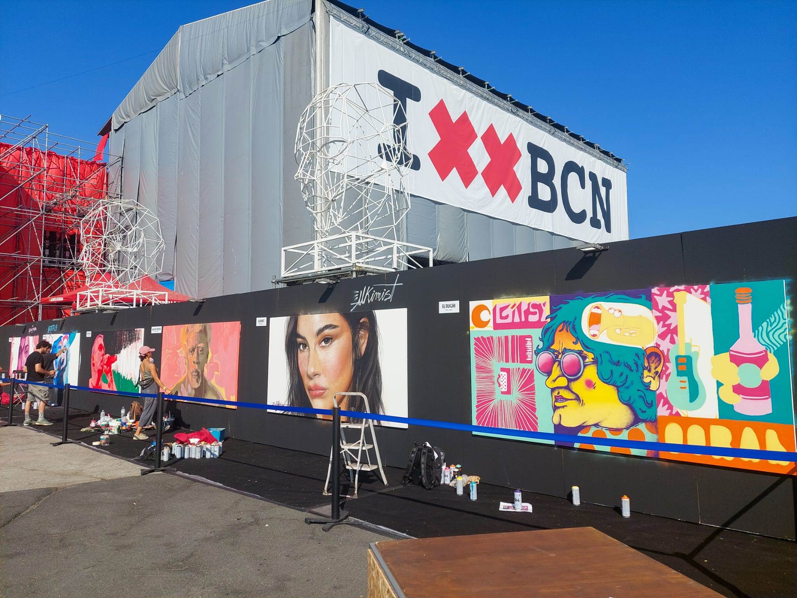
 
<em>Muro de grafitis en el recinto del Festival Cruïlla.</em>
   

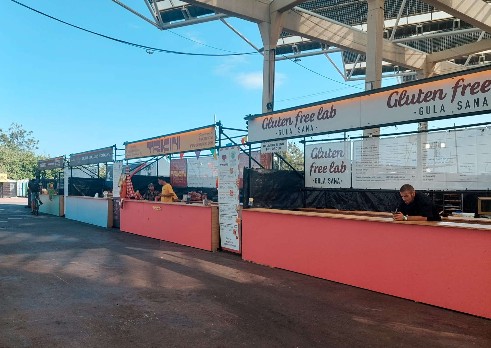
 
<em>Ejemplo de restauración de proximidad promovida por el Festival Cruïlla.</em>
   

 
<em>Elementos vinculados a la sostenibilidad promovidos por el festival.</em>

# Prototipos

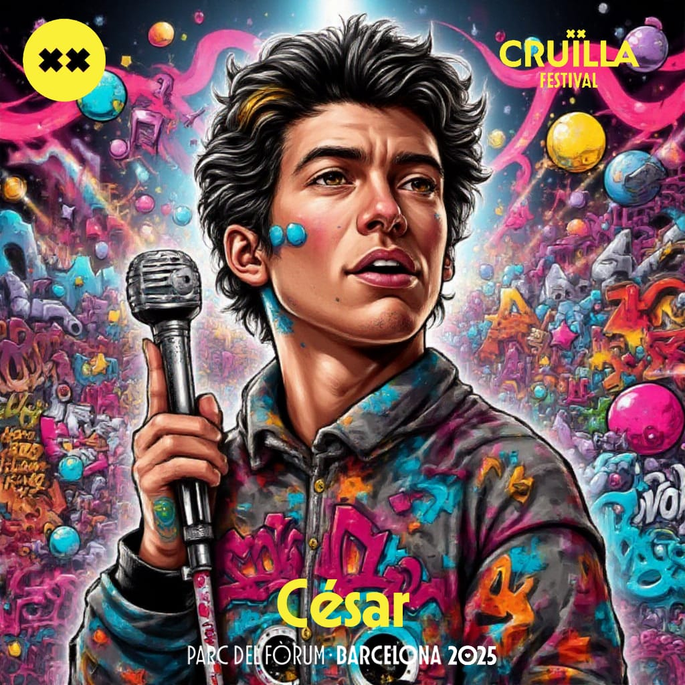
&nbsp;&nbsp;&nbsp;&nbsp;
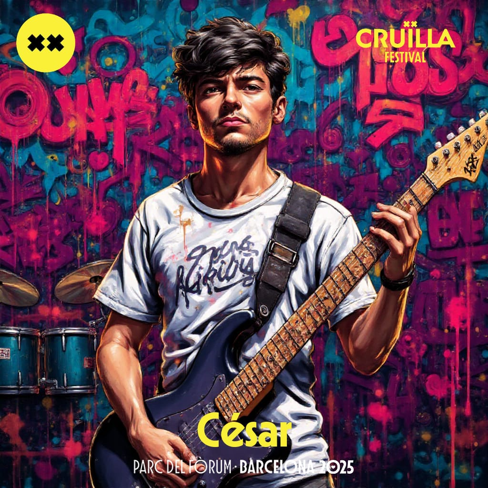
 
<em>Ejemplos de resultados generados por el prototipo del CVC, transformando a los participantes en estrellas del Festival Cruïlla.</em>
    

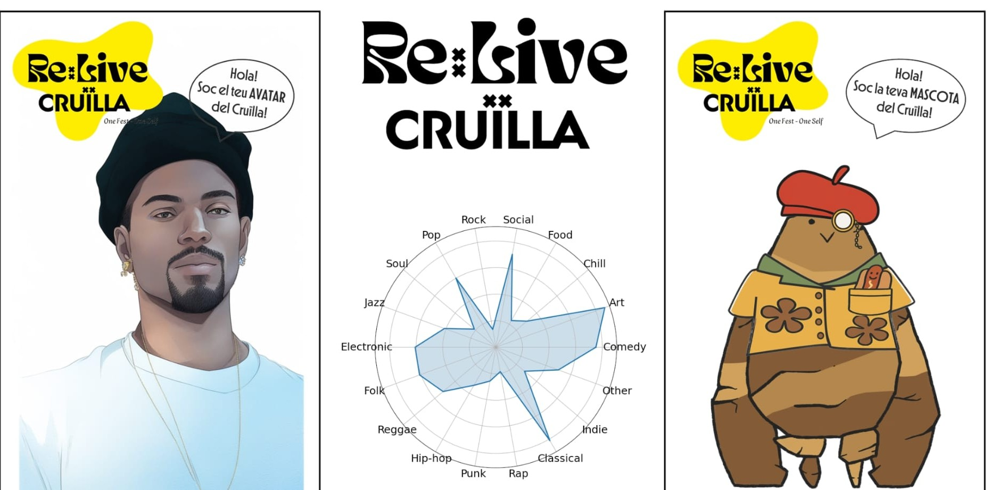
&nbsp;&nbsp;
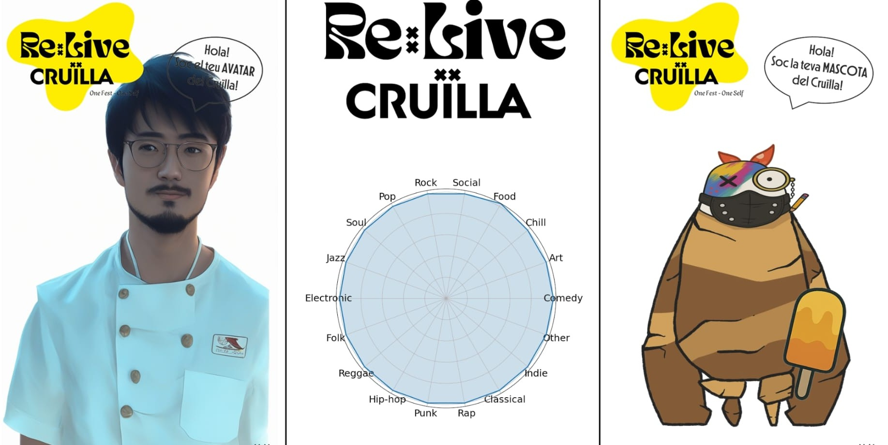
  
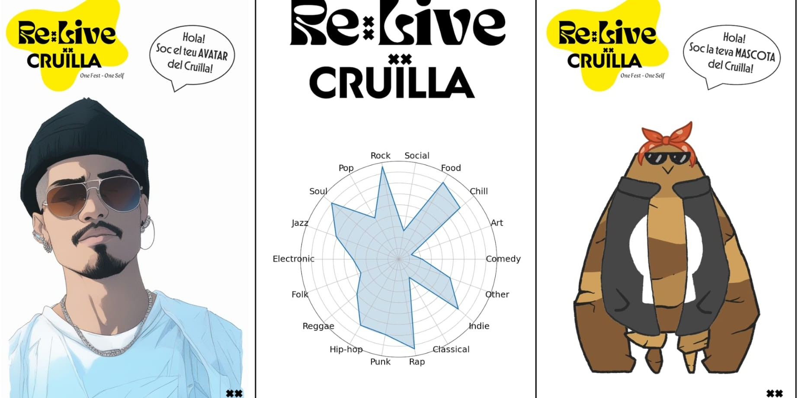
&nbsp;&nbsp;
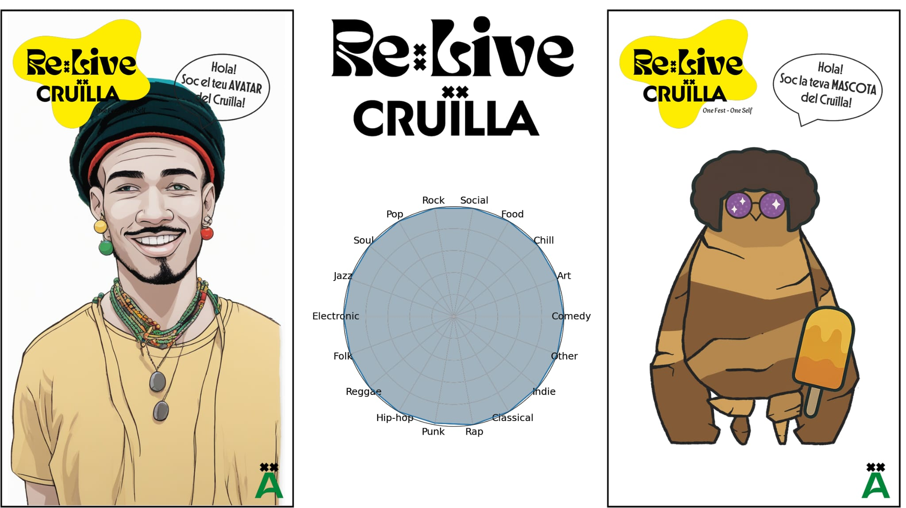
 
<em>Ejemplos de resultados generados por el prototipo de la UAB, combinando avatar personalizado y mascota asociada a las preferencias del participante.</em>
    

&nbsp;&nbsp;

&nbsp;&nbsp;

&nbsp;&nbsp;

 
<em>Pantallas de selección de preferencias musicales y personales utilizadas en el prototipo de la UAB.</em>
    

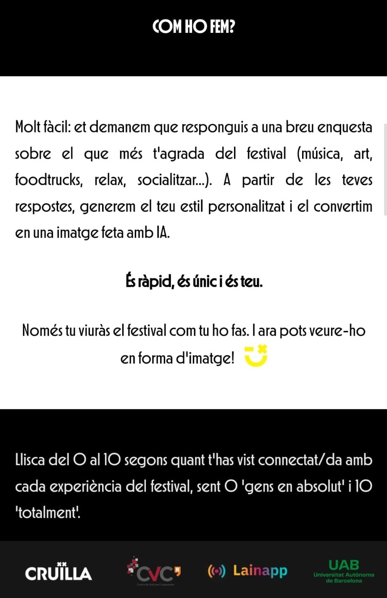
&nbsp;&nbsp;

&nbsp;&nbsp;

&nbsp;&nbsp;
 
<em>Material de explicación y difusión del prototipo de la UAB.</em>

